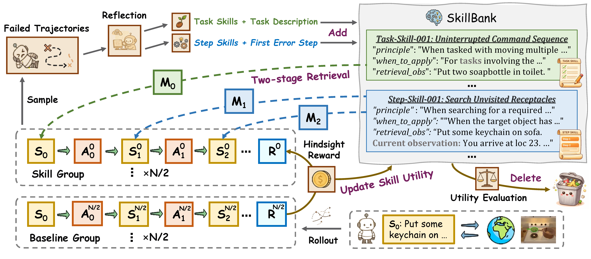

# D2Skill-AgenticRL

Code release for our paper **Dynamic Dual-Granularity Skill Bank for Agentic RL**.

<p align="center">
  
</p>

---

## 1) Environment Setup

This section follows the setup style of `README_old.md` and is adapted to the current repo.

### 1.1 Base installation

```bash
git clone https://github.com/TU2021/D2Skill-AgenticRL.git
cd D2Skill-AgenticRL

pip install -r requirements.txt
pip install vllm==0.11.0
pip install flash-attn==2.7.4.post1 --no-build-isolation --no-cache-dir
pip install -e .
pip install openai
```

### 1.2 Local environment file

`env.sh` is local-only and ignored by git.

```bash
cp env.example env.sh
```

Then edit `env.sh` with your own API keys, endpoints, and local paths.

### 1.3 Task environments

#### ALFWorld

```bash
pip install alfworld
pip install gymnasium==0.29.1
pip install stable-baselines3==2.6.0

# Download PDDL/game files and MaskRCNN detector
alfworld-download -f
```

#### WebShop

```bash
cd agent_system/environments/env_package/webshop
./setup.sh -d all
```

<!-- #### Search (optional)

```bash
cd agent_system/environments/env_package/search/third_party
pip install -e .
pip install gym==0.26.2
``` -->

---

## 2) Run Code (`examples_d2skill`)

### Important order

For embedding-based retrieval, you must:

1. **Start embedding retrieval service first**
2. **Start training script second**

### 2.1 Start embedding retrieval service (Terminal A)

```bash
cd /data/home/zdhs0006/SkillRL
bash examples_d2skill/skill_retrieval_launch.sh
```

Notes:
- Default port is `8003` in `skill_retrieval_launch.sh`.
- You can override by `PORT=xxxx`.
- You can control GPUs by editing `CUDA_VISIBLE_DEVICES` and `NUM_GPUS`.

### 2.2 Start training (Terminal B)

#### ALFWorld

```bash
cd /data/home/zdhs0006/SkillRL
bash examples_d2skill/run_alfworld_d2skill.sh
```

#### WebShop

```bash
cd /data/home/zdhs0006/SkillRL
bash examples_d2skill/run_webshop_d2skill.sh
```

Both scripts source `env.sh` at repo root.

---

## Citation

```bibtex
@article{tu2026d2skill,
  title={Dynamic Dual-Granularity Skill Bank for Agentic RL},
  author={Tu, Songjun and Xu, Chengdong and Zhang, Qichao and Zhang, Yaocheng and Lan, Xiangyuan and Li, Linjing and Zhao, Dongbin},
  journal={arXiv preprint arXiv:2603.28716},
  year={2026}
}
```